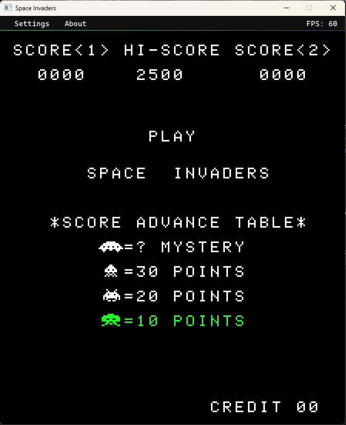
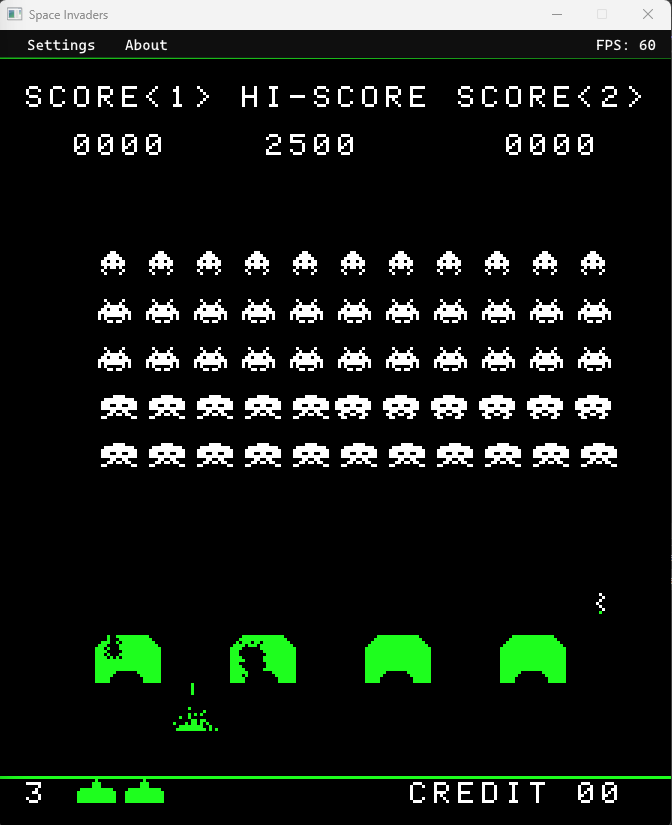
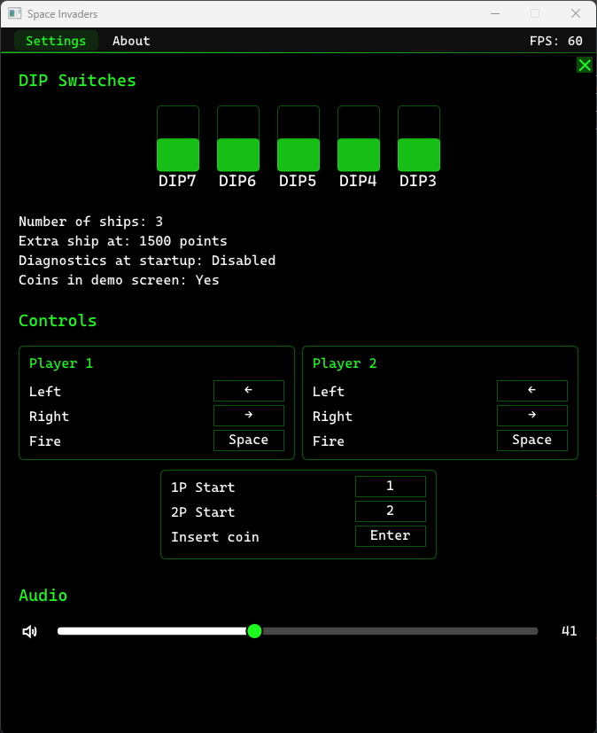

# space_invaders_emulator

Emulator for the classic Space Invaders arcade game from 1978!  
- Can run in a browser or as a native application
- Includes a complete emulation of the Intel 8080 microprocessor
- Supports original Space Invaders ROMs by Taito or Midway
- Cross-platform (Windows, Linux, MacOS, Web)

*This emulator includes the original Space Invaders ROM and audio and is hosted publicly for non-commercial, 
historical, and educational interest. All rights to the original game remain with the copyright holders.*

## Screenshots





## Build Prerequisites
- C++20 compiler (>= GCC 10, >= Clang 10, >= Visual Studio 2019)
- [CMake](https://cmake.org/) 3.15 or higher
- [Emscripten SDK](https://github.com/emscripten-core/emsdk) for Web build
- [SDL2](https://github.com/libsdl-org/SDL) (>= 2.0.17) and 
  [SDL2_mixer](https://github.com/libsdl-org/SDL_mixer) for native build

#### Installing SDL2 and SDL2_mixer
- Installing is optional, they can be fetched and built automatically by the build script
  (pass -DALLOW_SDL2_SRCBUILD=ON to CMake)
- If you wish to install:
   - On Linux install the following packages (or equivalent for your distro):   
	 libsdl2-2.0-0, libsdl2-dev, libsdl2-mixer-2.0-0, libsdl2-mixer-dev 
   - On Windows, download the [SDL2](https://github.com/libsdl-org/SDL/releases/download/release-2.30.3/SDL2-devel-2.30.3-VC.zip) 
	 and [SDL2_mixer](https://github.com/libsdl-org/SDL_mixer/releases/download/release-2.8.0/SDL2_mixer-devel-2.8.0-VC.zip) dev libraries and extract
   the contents to folders named "SDL2" and "SDL2_mixer" respectively. Place them in a [standard install location](https://cmake.org/cmake/help/latest/variable/CMAKE_SYSTEM_PREFIX_PATH.html#variable:CMAKE_SYSTEM_PREFIX_PATH) or in the same folder as the build script.

## Building
Once you have installed the prerequisites, run the following commands to build.  
The commands below apply to *most* use cases. You might need to modify it for yours.

### Native Build
```
git clone https://github.com/mayawarrier/space_invaders_emulator.git
cd space_invaders_emulator
mkdir release
mkdir build
cd build
cmake .. -DCMAKE_INSTALL_PREFIX="../release"
cmake --build .
cmake --install .
```
This creates a Release build in the folder `release`.  
Pass `-DALLOW_SDL2_SRCBUILD=ON` to CMake to automatically fetch and build SDL2 libraries.

### Web Build
Follow [these instructions](https://emscripten.org/docs/getting_started/downloads.html) first to setup Emscripten and add it to your PATH using emsdk,
then run the commands below.
```
git clone https://github.com/mayawarrier/space_invaders_emulator.git
cd space_invaders_emulator
web/scripts/./web-build -Install
```
This creates a Release build in the `out/install/Emscripten-Release`.    
You can run this using `web/scripts/./web-run -Install -Browser chrome` (starts a development server).

## Run options
```
1978 Space Invaders emulator.
Usage:
  spaceinvaders [OPTION...]

  -h, --help             Show usage.
  -a, --asset-dir <dir>  Directory containing game assets (ROM/audio/fonts
                         etc.) (default: assets/)
      --disable-ui       Disable emulator UI (menu/settings/about pages
                         etc.)

```